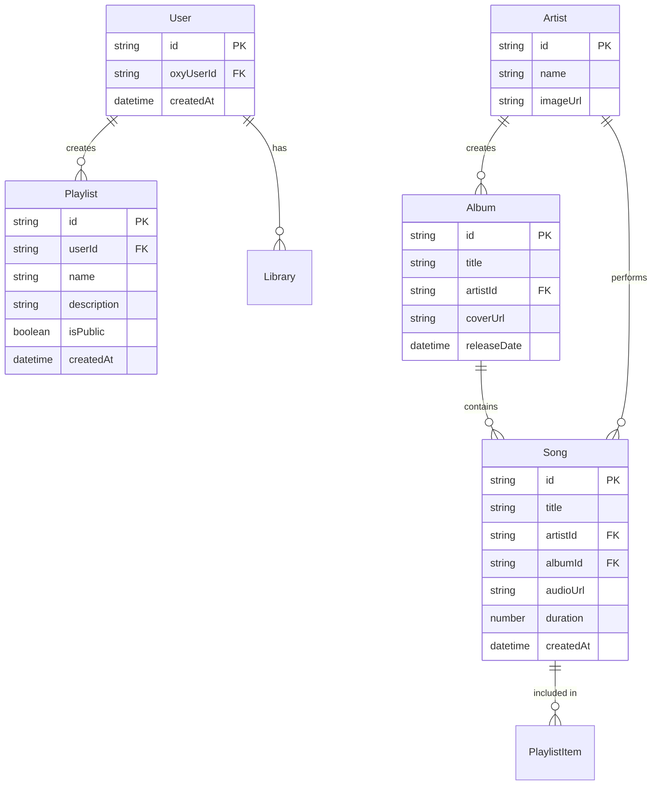

# @musico/backend

> The backend package of the Musico monorepo - A robust API service built with Express.js and TypeScript.

---

## Overview

This is the **backend package** of the **Musico** monorepo. The Musico API is a robust backend service built with Express.js and TypeScript, providing functionality for music streaming including song management, playlists, artists, albums, user library, search, audio file storage, and real-time communications.

## Tech Stack

- Node.js with TypeScript
- Express.js for REST API
- MongoDB with Mongoose for data storage
- Socket.IO for real-time features
- JWT for authentication

## Getting Started

### Prerequisites

- Node.js 18+ and npm 8+
- MongoDB instance
- Git

### Development Setup

#### Option 1: From the Monorepo Root (Recommended)
```bash
# Clone the repository
git clone https://github.com/OxyHQ/Musico.git
cd Musico

# Install all dependencies
npm run install:all

# Start backend development
npm run dev:backend
```

#### Option 2: From This Package Directory
```bash
# Navigate to this package
cd packages/backend

# Install dependencies
npm install

# Start development server
npm run dev
```

### Environment Configuration

Create a `.env` file in this package directory with the following variables:

```env
# Database
MONGODB_URI=your_mongodb_connection_string

# Authentication
# WE USE OXY FOR AUTHENTICATION

# Server Configuration
PORT=3000
NODE_ENV=development

# External Services
OPENAI_API_KEY=your_openai_api_key
TELEGRAM_BOT_TOKEN=your_telegram_bot_token

# AWS S3 Configuration (for audio file storage)
AWS_REGION=us-east-1
AWS_S3_BUCKET_NAME=musico-bucket
AWS_ACCESS_KEY_ID=your_aws_access_key_id
AWS_SECRET_ACCESS_KEY=your_aws_secret_access_key
AWS_ENDPOINT_URL=http://localhost:4566  # Optional: Custom endpoint for LocalStack, MinIO, etc.
S3_AUDIO_PREFIX=audio
```

### Running the API

#### Development Mode
```bash
npm run dev
```

#### Production Mode
```bash
npm run build
npm start
```

### Database Setup

The API uses MongoDB with Mongoose. Make sure your MongoDB instance is running and accessible.

#### Running Migrations
```bash
# Development environment
npm run migrate:dev

# Production environment
npm run migrate
```

## API Endpoints

### Authentication

The API uses **Oxy** for user authentication and user data management. All user-related data is linked to Oxy users.

### Music Library

#### GET /api/songs
- Retrieves songs
- Query params: `limit`, `offset`, `search`
- Returns list of songs with metadata

#### GET /api/songs/:id
- Retrieves a specific song
- Returns song details including audio URL, metadata, artist, album

### Playlists

#### GET /api/playlists
- Retrieves user's playlists
- Authentication: Bearer token required
- Returns list of playlists

#### POST /api/playlists
- Creates a new playlist
- Authentication: Bearer token required
- Body: `{ name: string, description?: string, isPublic?: boolean }`

#### GET /api/playlists/:id
- Retrieves playlist details including songs
- Returns playlist with song list

#### PUT /api/playlists/:id
- Updates playlist details
- Authentication: Bearer token required

#### DELETE /api/playlists/:id
- Deletes a playlist
- Authentication: Bearer token required

### Artists

#### GET /api/artists
- Retrieves artists
- Query params: `limit`, `offset`, `search`
- Returns list of artists

#### GET /api/artists/:id
- Retrieves artist details
- Returns artist info, albums, and songs

### Albums

#### GET /api/albums
- Retrieves albums
- Query params: `limit`, `offset`, `search`
- Returns list of albums

#### GET /api/albums/:id
- Retrieves album details
- Returns album info and track list

### Search

#### GET /api/search
- Search across songs, artists, albums, and playlists
- Query params: `q` (search query), `type` (songs|artists|albums|playlists), `limit`
- Returns search results

## Database Schema Relationships



## Development Scripts

- `npm run dev` — Start development server with hot reload
- `npm run build` — Build the project
- `npm run start` — Start production server
- `npm run lint` — Lint codebase
- `npm run clean` — Clean build artifacts
- `npm run migrate` — Run database migrations
- `npm run migrate:dev` — Run database migrations in development
- `npm run test` — Run tests (placeholder)

## Monorepo Integration

This package is part of the Musico monorepo and integrates with:

- **@musico/frontend**: React Native application
- **@musico/shared-types**: Shared TypeScript type definitions

### Shared Dependencies
- Uses `@musico/shared-types` for type safety across packages
- Integrates with `@oxyhq/services` for common functionality

## Performance Optimization

### Caching Strategy
- Implement Redis caching for:
  - Popular songs (TTL: 15 minutes)
  - Artist and album data (TTL: 1 hour)
  - User playlists (TTL: 30 minutes)
  - Search results (TTL: 5 minutes)

### Database Indexing
```javascript
// Song Collection Indexes
db.songs.createIndex({ "title": "text", "artist": "text" })
db.songs.createIndex({ "artistId": 1, "albumId": 1 })
db.songs.createIndex({ "createdAt": -1 })

// Album Collection Indexes
db.albums.createIndex({ "title": "text" })
db.albums.createIndex({ "artistId": 1, "releaseDate": -1 })

// Artist Collection Indexes
db.artists.createIndex({ "name": "text" })

// Playlist Collection Indexes
db.playlists.createIndex({ "userId": 1, "createdAt": -1 })
```

## Monitoring and Logging

### Health Check Endpoint
```
GET /health
Response: {
  "status": "healthy",
  "version": "1.0.0",
  "uptime": 1000,
  "mongoStatus": "connected"
}
```

### Logging
- Use Winston for structured logging
- Log levels: error, warn, info, debug
- Include request ID in all logs

## Deployment

### Docker Deployment
```bash
# Build the Docker image
docker build -t musico-api .

# Run the container
docker run -p 3000:3000 -e MONGODB_URI=your_mongodb_uri musico-api
```

### Cloud Deployment (Vercel)
1. Configure `vercel.json`:
```json
{
  "version": 2,
  "builds": [{
    "src": "dist/server.js",
    "use": "@vercel/node"
  }],
  "routes": [{
    "src": "/(.*)",
    "dest": "dist/server.js"
  }]
}
```

2. Deploy using Vercel CLI:
```bash
vercel --prod
```

## Audio File Storage

Audio files are stored in AWS S3. The API handles:
- Uploading audio files to S3
- Generating presigned URLs for secure audio streaming
- Managing audio file metadata

### S3 Configuration
Set these env vars in `packages/backend/.env`:
```
AWS_REGION=us-east-1
AWS_S3_BUCKET_NAME=musico-audio
AWS_ACCESS_KEY_ID=your_aws_access_key_id
AWS_SECRET_ACCESS_KEY=your_aws_secret_access_key
AWS_ENDPOINT_URL=http://localhost:4566  # Optional: Custom endpoint for LocalStack, MinIO, etc.
S3_AUDIO_PREFIX=audio
```

## Troubleshooting Guide

### Common Issues

1. Connection Timeouts
```
Error: MongoTimeoutError
Solution: Check MongoDB connection string and network connectivity
```

2. Authentication Failures
```
Error: JsonWebTokenError
Solution: Verify token expiration and secret keys
```

3. Rate Limit Exceeded
```
Error: 429 Too Many Requests
Solution: Implement exponential backoff in client
```

## Contributing

Contributions are welcome! Please see the [main README](../../README.md) for the complete contributing guidelines.

1. Fork the repository
2. Create a feature branch
3. Make your changes
4. Run tests and linting: `npm run test && npm run lint`
5. Submit a pull request

## License

This project is licensed under the AGPL License.
